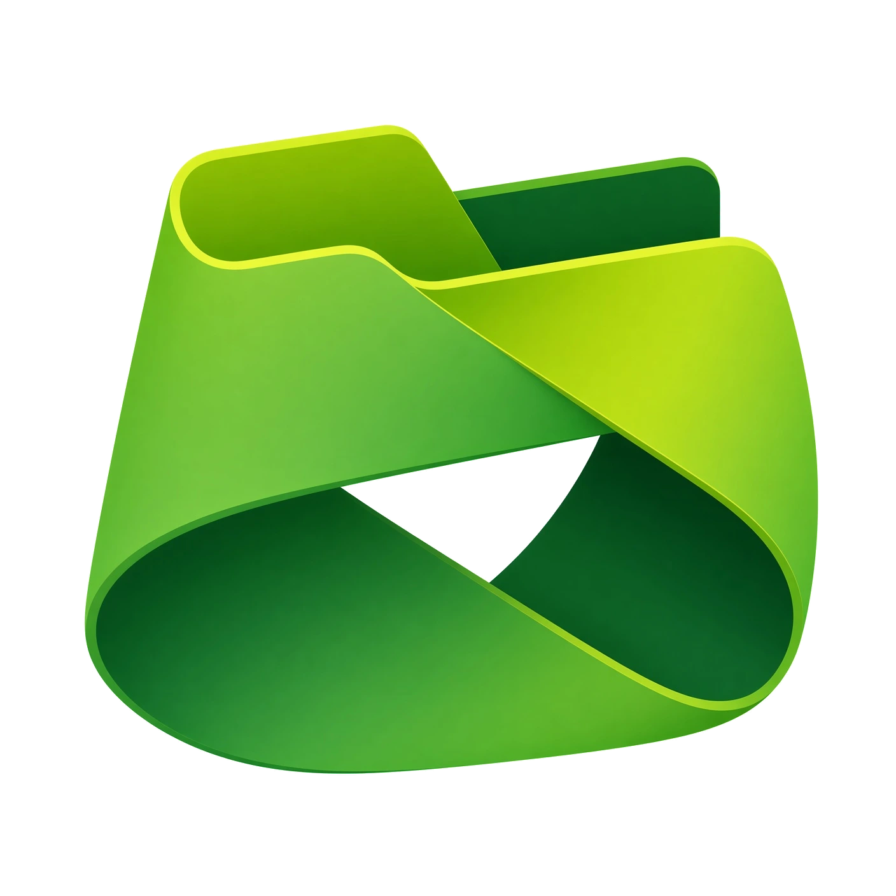
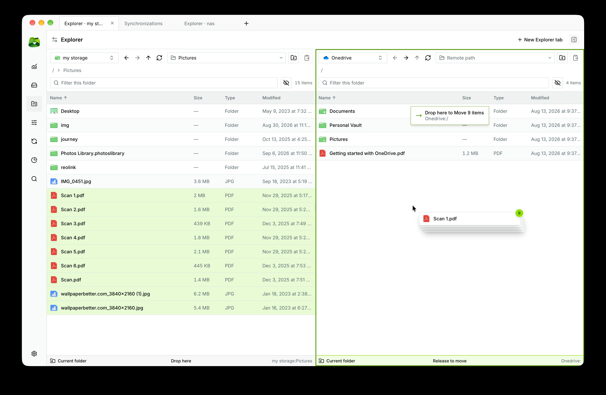
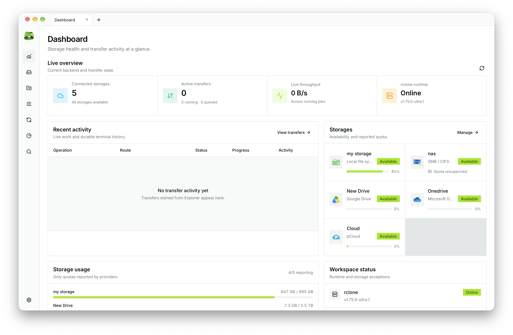
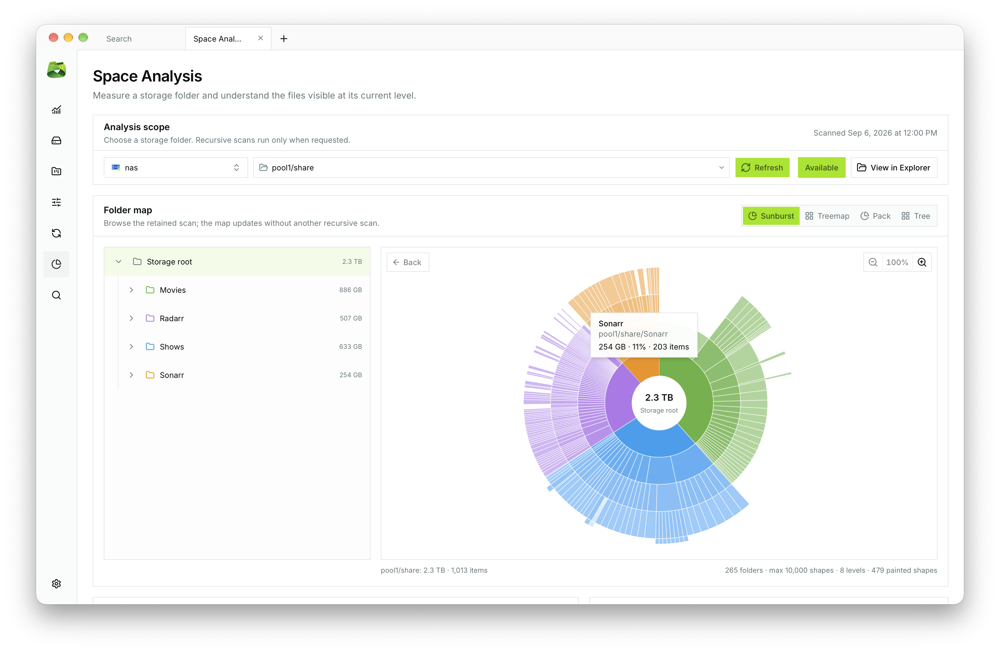

<div align="center">
  <a href="https://ultra-explorer.app/">
    
  </a>

  <h1>Ultra Explorer</h1>

  <p><strong>The modern file manager for all your clouds.</strong></p>
  <p>
    Browse, transfer, synchronize, and visualize your data across more than 40 cloud providers,
    object stores, NAS systems, and local storage — from one fast dual-pane interface.
  </p>

  <p>
    <a href="https://ultra-explorer.app/"><strong>Website</strong></a>
    ·
    <a href="https://github.com/Sudo-Rahman/UltraExplorer-Releases/releases"><strong>Download</strong></a>
    ·
    <a href="https://ultra-explorer.app/docs"><strong>Documentation</strong></a>
  </p>

  <p>
    
    
    
  </p>
</div>



## All your storage, one explorer

Ultra Explorer brings the power of [rclone](https://rclone.org/) to a polished native interface.
Work between two locations at once, drag files from one cloud to another, preview synchronization
changes before they happen, and understand where your storage space is going.

- **Dual-pane explorer** with tabs, filtering, contextual actions, and drag-and-drop transfers
- **40+ storage providers and protocols**, including Google Drive, OneDrive, S3, Dropbox,
  Nextcloud, SMB, SFTP, WebDAV, and local folders
- **Safe synchronization** with dry-run previews and explicit conflict handling
- **Visual space analysis** with sunburst, treemap, circle-pack, and tree views
- **Native and self-hosted** distributions for desktop, Docker, and NAS environments
- **Private by design** with direct provider connections and no telemetry

<table>
  <tr>
    <td width="50%">
      
    </td>
    <td width="50%">
      
    </td>
  </tr>
  <tr>
    <td align="center"><strong>One dashboard for every storage</strong></td>
    <td align="center"><strong>See exactly where your space goes</strong></td>
  </tr>
</table>

## Download

Official installers for macOS, Windows, and Linux are published on the
[Releases page](https://github.com/Sudo-Rahman/UltraExplorer-Releases/releases).

The server edition is also available from GitHub Container Registry:

```bash
docker pull ghcr.io/sudo-rahman/ultra-explorer:latest
```

Release assets include SHA-256 checksums and build provenance attestations.

## About this repository

This repository publishes the official Ultra Explorer binaries and container images. Application
development takes place in a private source repository; only release workflows, product visuals,
verified installers, checksums, and final runtime images are made public here.

<div align="center">
  <br />
  <strong>Your clouds. Your machine. Your data.</strong>
  <br /><br />
  <a href="https://ultra-explorer.app/">ultra-explorer.app</a>
</div>

## Signed application updates

Direct desktop releases use signed updater artifacts. Stable updates require the
complete macOS ARM64 / Windows x64 / Linux x64 matrix. Maintainers can run isolated
public macOS prerelease tests from an exact private source SHA using the existing
workflow on a dedicated branch, without changing main or the stable feed. See
[release and updater test instructions](RELEASING.md).
