<div align="center">
  <a href="https://ultra-explorer.app/">
    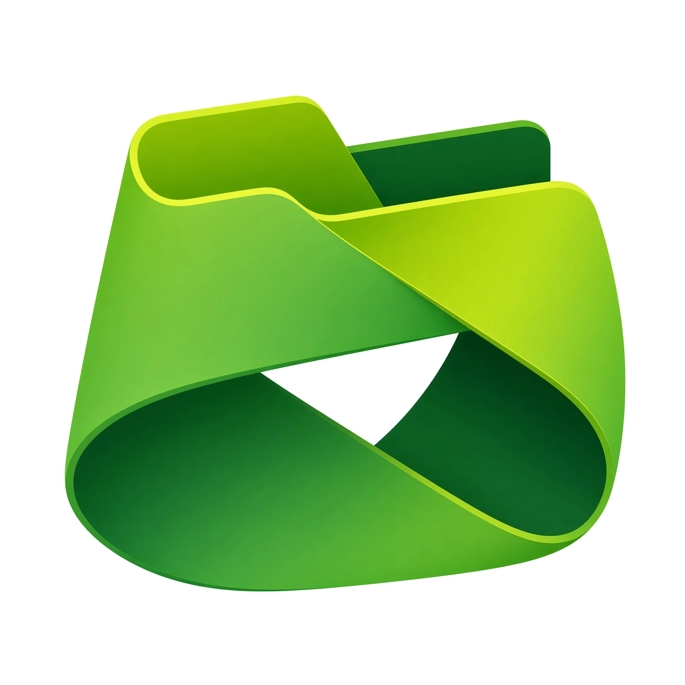
  </a>

  <h1>Ultra Explorer</h1>

  <p><strong>A file manager for all your clouds.</strong></p>
  <p>
    Browse, transfer, synchronize and analyze your files across Google Drive, OneDrive, S3, Dropbox,
    your NAS and 40+ other storages, side by side in one fast dual-pane app. Powered by
    <a href="https://rclone.org/">rclone</a>, with no server of ours in the middle.
  </p>

  <p>
    <a href="https://github.com/Sudo-Rahman/UltraExplorer-Releases/releases/latest"><strong>Download</strong></a>
    ·
    <a href="https://ultra-explorer.app/"><strong>Website</strong></a>
    ·
    <a href="https://ultra-explorer.app/docs"><strong>Documentation</strong></a>
    ·
    <a href="https://ultra-explorer.app/pricing"><strong>Pricing</strong></a>
  </p>

  <p>
    <a href="https://github.com/Sudo-Rahman/UltraExplorer-Releases/releases/latest"></a>
    <a href="https://github.com/Sudo-Rahman/UltraExplorer-Releases/releases"></a>
    
    
  </p>
</div>

<br />

<p align="center"><strong>▶ Watch the trailer (1:52)</strong></p>


https://github.com/user-attachments/assets/7ac566d6-2f84-4c23-afdf-7bea404a6d4b


<picture>
  <source media="(prefers-color-scheme: dark)" srcset="assets/readme/hero-explorer-dark.webp" />
  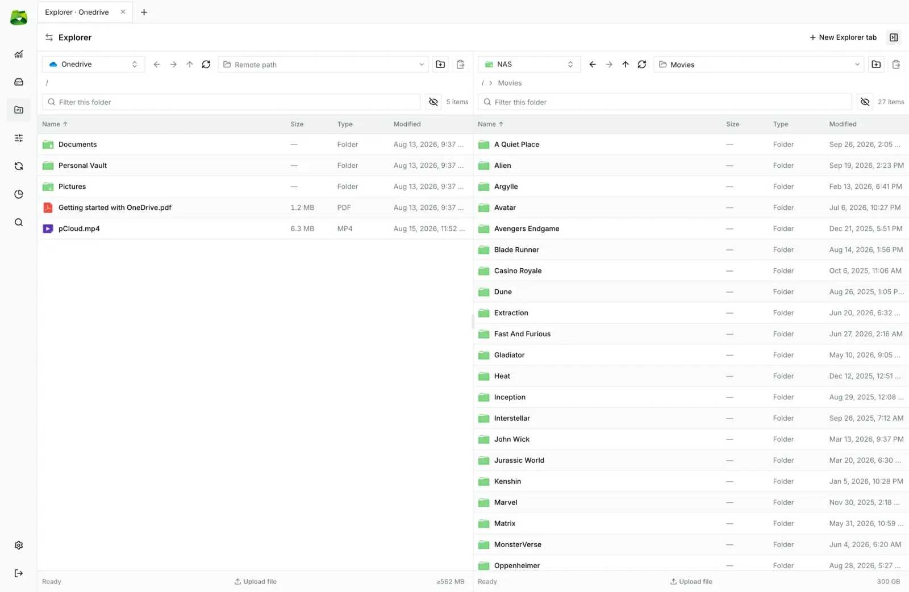
</picture>

## Contents

- [Why Ultra Explorer](#why-ultra-explorer)
- [Features](#features)
  - [Dual-pane explorer](#dual-pane-explorer)
  - [40+ storages](#40-storages)
  - [Transfer queue](#transfer-queue)
  - [Synchronizations](#synchronizations)
  - [Space analysis](#space-analysis)
  - [Multi-cloud search](#multi-cloud-search)
  - [Dashboard, settings and shortcuts](#dashboard-settings-and-shortcuts)
  - [Docker, NAS and phone](#docker-nas-and-phone)
- [Download and install](#download-and-install)
- [Free, Pro and Lifetime](#free-pro-and-lifetime)
- [Privacy and security](#privacy-and-security)
- [Supported storages](#supported-storages)
- [About this repository](#about-this-repository)

## Why Ultra Explorer

Your files live everywhere: a laptop, a NAS, two or three clouds, an S3 bucket for archives.
Ultra Explorer puts all of them in one window.

- **Two panes, any two storages.** Drag files from OneDrive to your NAS, or between two S3 buckets.
- **Nothing changes by surprise.** Conflicts always ask, and every synchronization can be previewed
  before it runs.
- **See where your space goes.** Four interactive maps of any folder, on any storage.
- **Native and light.** A Rust core with a native desktop app, or a self-hosted Docker server.
- **Private by design.** No telemetry. Your keys stay in `rclone.conf` on your machine and your files
  never pass through our servers.

## Features

### Dual-pane explorer

Two independent panels, each with its own storage, tabs and navigation history. Filter a folder as
you type, open the context menu for copy, move, rename or delete, and drag files across panes to
transfer them, from local to cloud or between two remote storages.

- **Drag and drop transfers** between any two storages
- **No silent overwrites:** every conflict asks you to overwrite, skip or keep both
- **Tabs** with saved paths and filters
- **Recursive folder size** on demand

<table>
  <tr>
    <td width="50%">
      <picture>
        <source media="(prefers-color-scheme: dark)" srcset="assets/readme/explorer-context-menu-dark.webp" />
        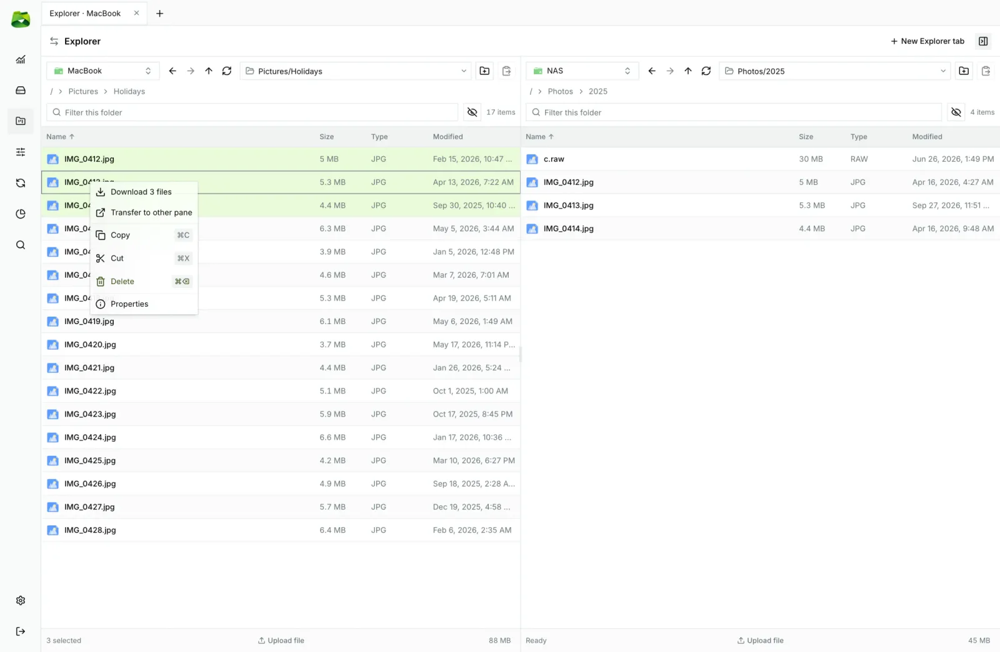
      </picture>
    </td>
    <td width="50%">
      <picture>
        <source media="(prefers-color-scheme: dark)" srcset="assets/readme/dashboard-dark.webp" />
        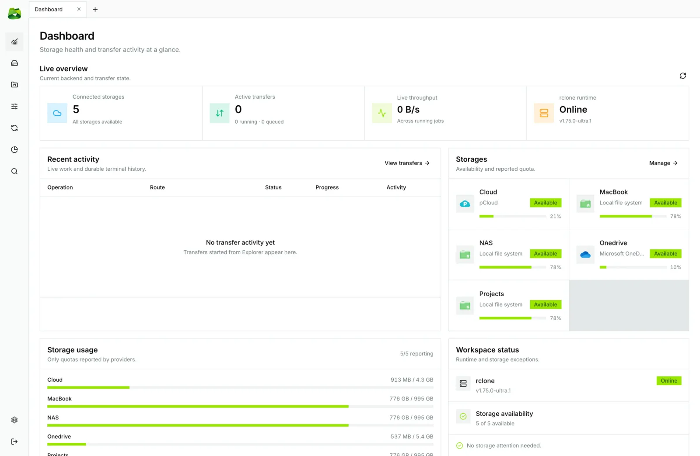
      </picture>
    </td>
  </tr>
  <tr>
    <td align="center">Copy, move and organize with the context menu</td>
    <td align="center">Storage health and transfer activity at a glance</td>
  </tr>
</table>

### 40+ storages

Ultra Explorer uses rclone to connect natively to more than 40 clouds, object stores, NAS and
network protocols. Add a storage with a guided form, or import the `rclone.conf` you already have
and keep using it from the command line.

<table>
  <tr>
    <td width="50%">
      <picture>
        <source media="(prefers-color-scheme: dark)" srcset="assets/readme/storages-dark.webp" />
        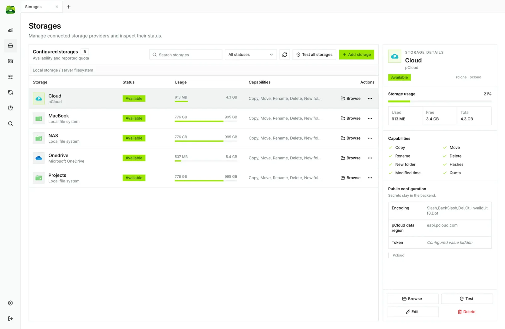
      </picture>
    </td>
    <td width="50%">
      <picture>
        <source media="(prefers-color-scheme: dark)" srcset="assets/readme/storage-add-smb-wizard-dark.webp" />
        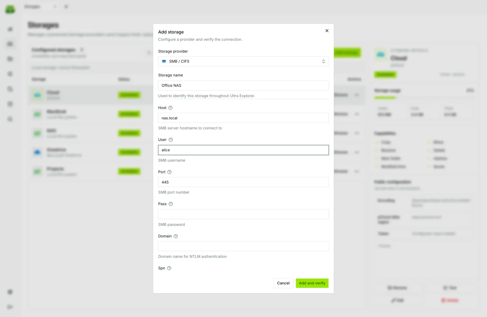
      </picture>
    </td>
  </tr>
  <tr>
    <td align="center">All your storages, with availability and quota</td>
    <td align="center">Add a NAS, a cloud or a server in a few fields</td>
  </tr>
</table>

See the full list in [Supported storages](#supported-storages).

### Transfer queue

Every copy and move goes into a persistent FIFO queue that never blocks the interface. Follow live
throughput, inspect each job (route, progress, speed, timeline), and pick up where you left off after
a restart: the queue is stored in SQLite.

<picture>
  <source media="(prefers-color-scheme: dark)" srcset="assets/readme/transfers-workspace-dark.webp" />
  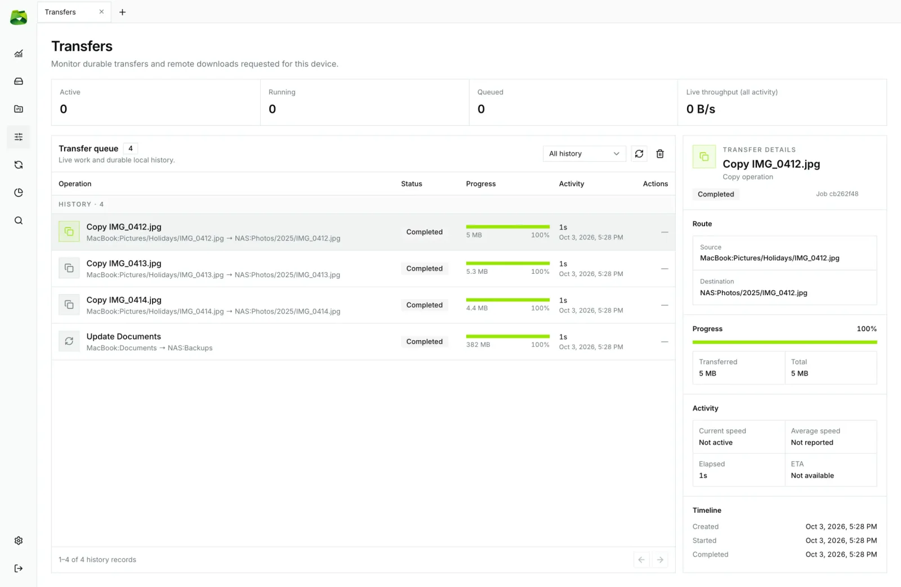
</picture>

### Synchronizations

Create a synchronization in six guided steps: route, behavior, rules and safety, schedule, review and
preview.

- **Safe Update** copies new and changed files and never removes anything at the destination.
  **Exact Mirror** makes the destination match the source.
- **Dry-run preview:** see which files will be copied, updated or removed before anything changes.
- **Guardrails:** exclusion rules and a maximum-deletion threshold.
- **Schedules:** manual, interval, daily or weekly, with run history and logs.

<table>
  <tr>
    <td width="50%">
      <picture>
        <source media="(prefers-color-scheme: dark)" srcset="assets/readme/sync-wizard-behavior-dark.webp" />
        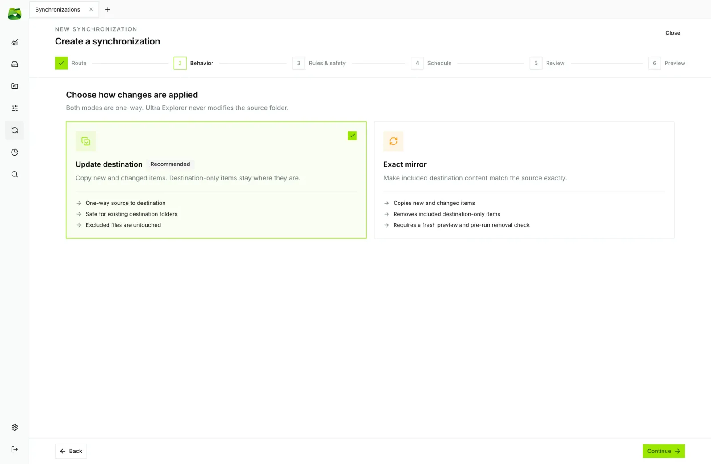
      </picture>
    </td>
    <td width="50%">
      <picture>
        <source media="(prefers-color-scheme: dark)" srcset="assets/readme/sync-dryrun-dark.webp" />
        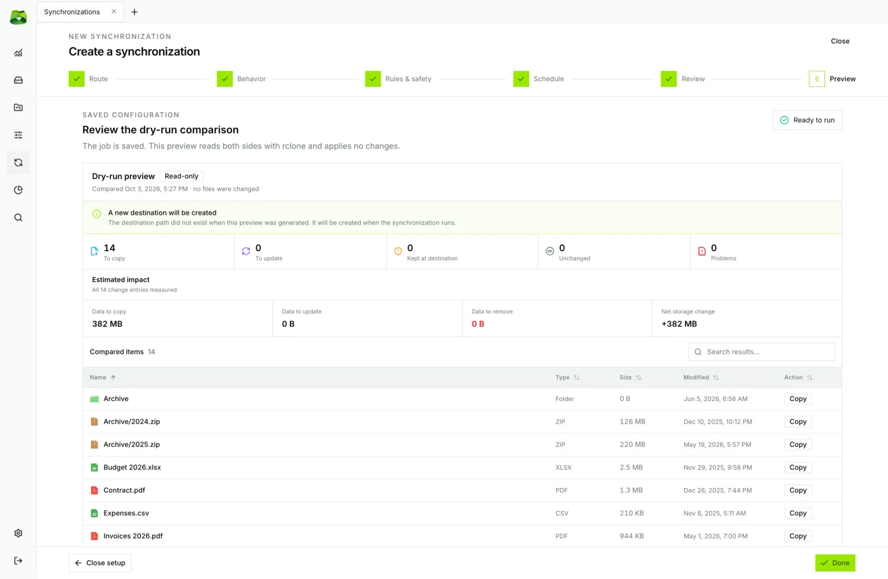
      </picture>
    </td>
  </tr>
  <tr>
    <td align="center">Safe Update or Exact Mirror</td>
    <td align="center">Preview every change before it runs</td>
  </tr>
</table>

### Space analysis

Scan any folder, on any storage, and explore it as a **sunburst**, **treemap**, **circle pack** or
**tree**. Zoom into a folder in one click and jump straight to it in the explorer.

<table>
  <tr>
    <td width="50%">
      <picture>
        <source media="(prefers-color-scheme: dark)" srcset="assets/readme/space-analysis-sunburst-dark.webp" />
        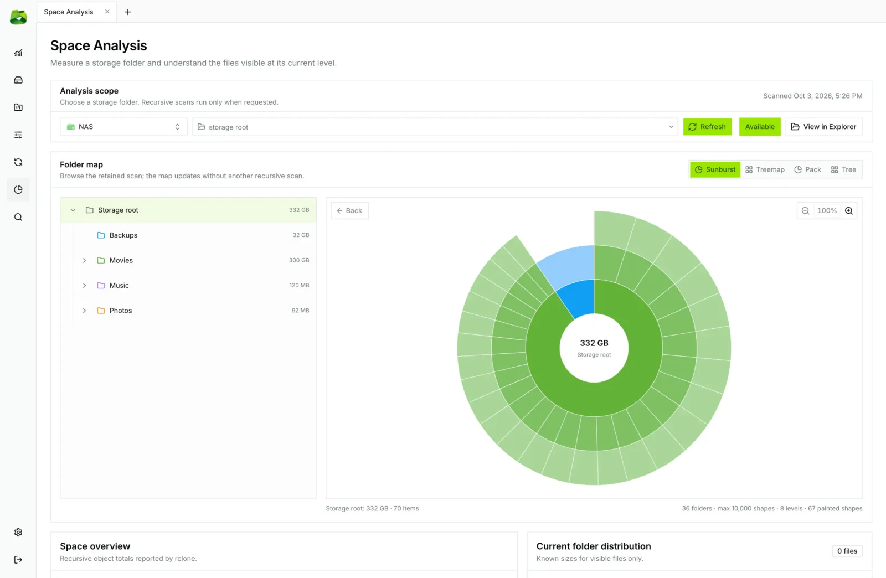
      </picture>
    </td>
    <td width="50%">
      <picture>
        <source media="(prefers-color-scheme: dark)" srcset="assets/readme/space-analysis-treemap-dark.webp" />
        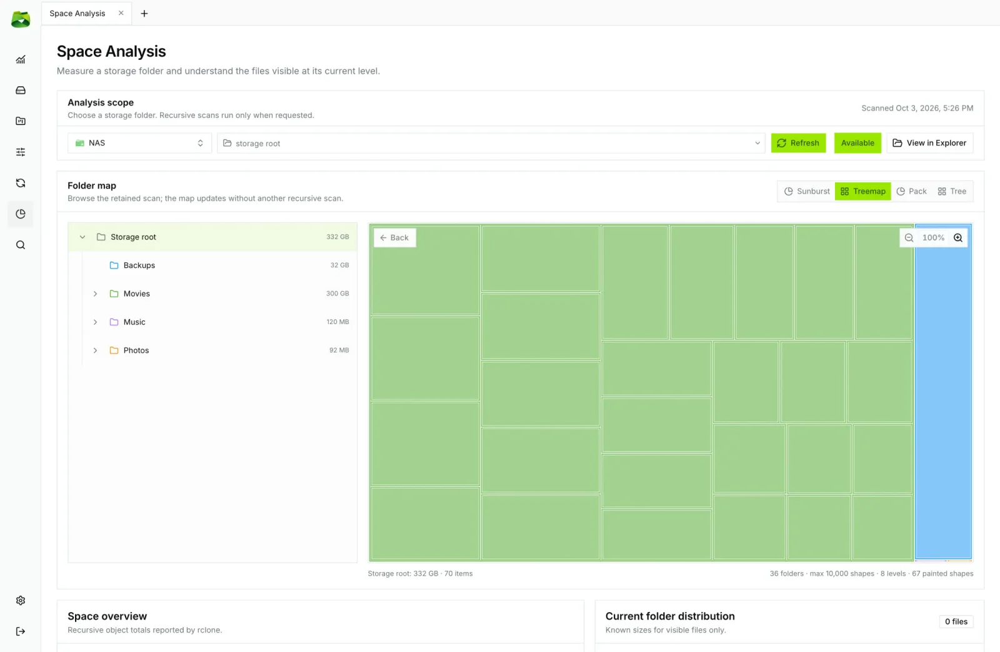
      </picture>
    </td>
  </tr>
  <tr>
    <td align="center">Sunburst</td>
    <td align="center">Treemap</td>
  </tr>
</table>

### Multi-cloud search

Search up to eight storages at once, in parallel. Start from a preset (documents, images,
archives…), refine with typed filters, and browse up to 50,000 results in a virtualized table with
the exact location of every file.

<picture>
  <source media="(prefers-color-scheme: dark)" srcset="assets/readme/unified-search-dark.webp" />
  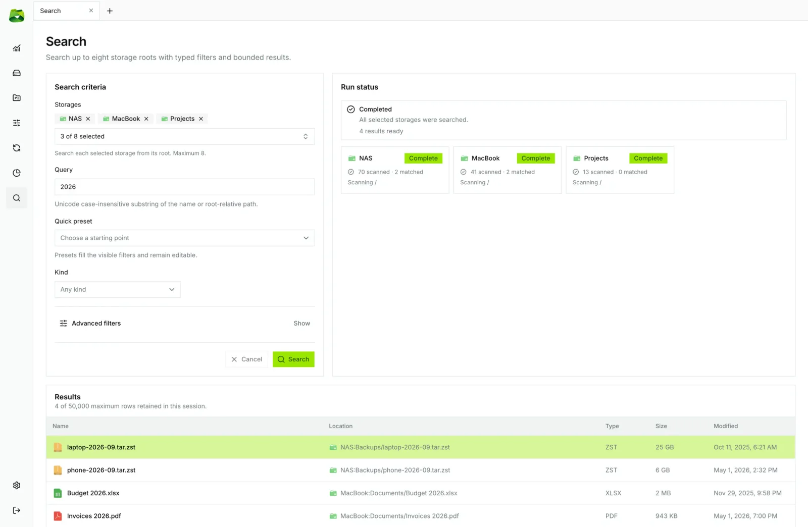
</picture>

### Dashboard, settings and shortcuts

- **Dashboard:** connected storages, quotas, live throughput and recent activity.
- **Light, dark or system theme.**
- **10 languages**, switched without reloading: English, French, German, Spanish, Italian,
  Portuguese, Chinese, Japanese, Korean and Russian.
- **Keyboard shortcuts** for the explorer, listed in Settings and shown next to menu actions
  (⌘ on macOS, Ctrl on Windows).

<picture>
  <source media="(prefers-color-scheme: dark)" srcset="assets/readme/settings-shortcuts-dark.webp" />
  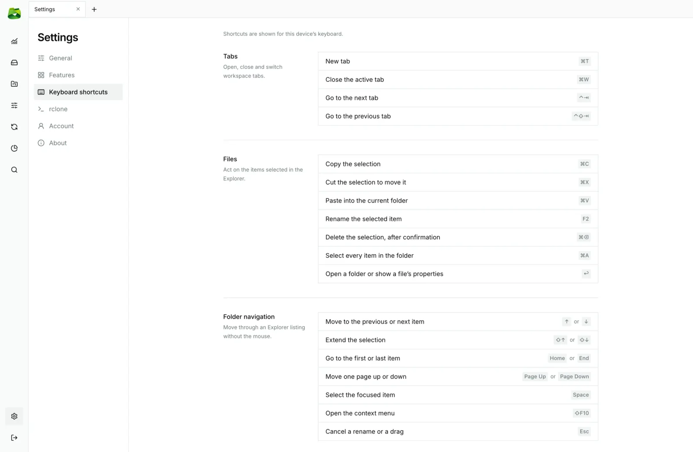
</picture>

### Docker, NAS and phone

The Docker edition serves the same interface to any browser. Run it on your NAS or home server and
install it on your phone's home screen as an app (PWA), with a layout built for touch: stacked panes,
a Select mode with an actions bar, and settings as a list.

<p align="center">
  <picture>
    <source media="(prefers-color-scheme: dark)" srcset="assets/readme/mobile-explorer-dark.webp" />
    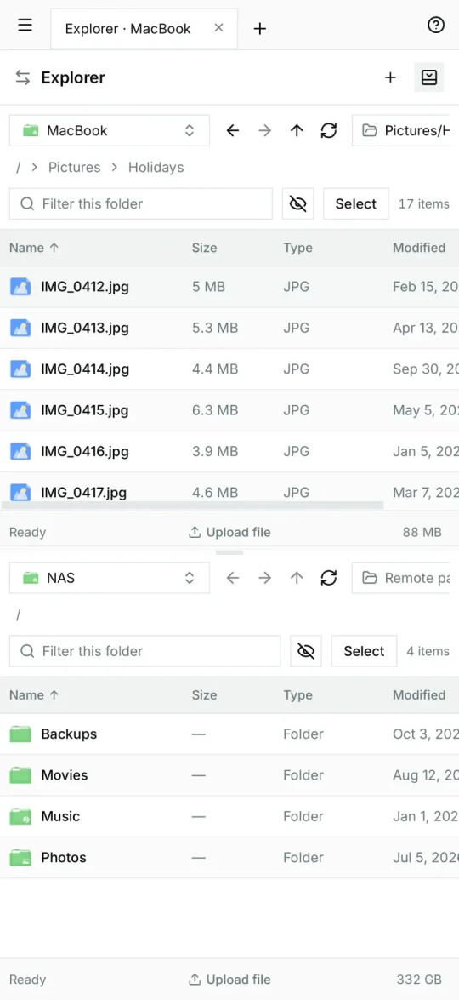
  </picture>
  &nbsp;&nbsp;
  <picture>
    <source media="(prefers-color-scheme: dark)" srcset="assets/readme/mobile-dashboard-dark.webp" />
    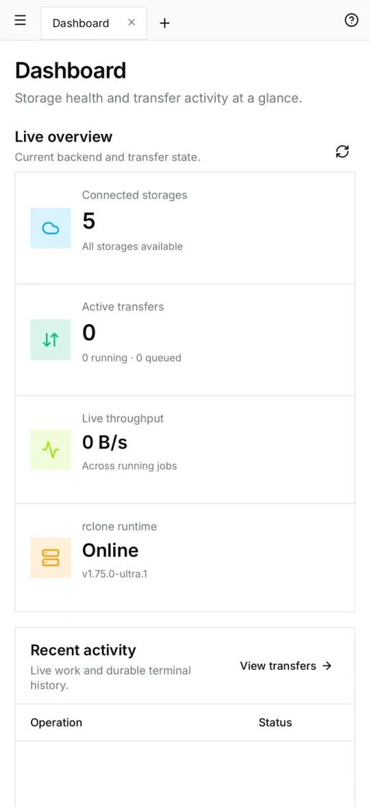
  </picture>
</p>

## Download and install

| Platform | Download | Requirements |
| --- | --- | --- |
| **macOS** | [`.dmg` from the latest release](https://github.com/Sudo-Rahman/UltraExplorer-Releases/releases/latest) or Homebrew | Apple Silicon |
| **Windows** | [`.exe` installer from the latest release](https://github.com/Sudo-Rahman/UltraExplorer-Releases/releases/latest) | Windows 10 or 11, x64 |
| **Docker** | `ghcr.io/sudo-rahman/ultra-explorer` | Any Docker host or NAS |
| **Linux** | Coming soon | |

### macOS with Homebrew

```bash
brew install --cask sudo-rahman/tap/ultra-explorer
```

### Docker

1. Create a `.env` file next to your `compose.yml` with an admin password:

   ```bash
   ULTRA_ADMIN_PASSWORD=change-me
   ```

2. Save this as `compose.yml`:

   ```yaml
   services:
     ultra-explorer:
       image: ghcr.io/sudo-rahman/ultra-explorer:latest
       restart: unless-stopped
       ports:
         - "7373:7373"
       environment:
         ULTRA_ADMIN_PASSWORD: "${ULTRA_ADMIN_PASSWORD:?Set ULTRA_ADMIN_PASSWORD in .env}"
         ULTRA_LOCAL_ROOTS: /mnt/local
       volumes:
         - ultra-data:/data
         - ./files:/mnt/local
       read_only: true
       tmpfs:
         - /tmp:size=64m,mode=1777
       security_opt:
         - no-new-privileges:true
       cap_drop:
         - ALL

   volumes:
     ultra-data:
   ```

3. Start it and open `http://<your-server>:7373`:

   ```bash
   docker compose up -d
   ```

The container runs unprivileged with a read-only root filesystem, and keeps its data in a single
volume. Step-by-step guides, including installing the app on a phone, are in the
[documentation](https://ultra-explorer.app/docs).

## Free, Pro and Lifetime

Ultra Explorer is free to download and use. **Pro** (subscription) and **Lifetime** (one-time
purchase) unlock multi-cloud search, space analysis and scheduled synchronizations.
See [ultra-explorer.app/pricing](https://ultra-explorer.app/pricing).

## Privacy and security

- **No telemetry.**
- **Your credentials stay with you:** API keys, OAuth tokens and passwords are stored in
  `rclone.conf` on your machine.
- **Direct connections:** files move between your device and your storages; they never pass through
  our servers.
- **Verified releases:** every release ships `SHA256SUMS` and build provenance attestations, macOS
  builds are signed and notarized, and in-app updates are signed.

## Supported storages

<table>
  <tr>
    <th>Clouds</th>
    <th>Object storage</th>
    <th>Protocols and NAS</th>
    <th>Virtual</th>
  </tr>
  <tr valign="top">
    <td>
      Google Drive<br />Microsoft OneDrive<br />Dropbox<br />Proton Drive<br />MEGA<br />pCloud<br />Box<br />Filen<br />Internxt<br />Jottacloud<br />Koofr<br />HiDrive<br />Yandex Disk<br />Drime<br />PikPak<br />OpenDrive<br />FileLu<br />Files.com<br />Gofile<br />Pixeldrain<br />Put.io<br />Mail.ru Cloud<br />Shade
    </td>
    <td>
      Amazon S3 and S3-compatible<br />Google Cloud Storage<br />Azure Blob Storage<br />Backblaze B2<br />Oracle Object Storage<br />Storj<br />OpenStack Swift<br />ImageKit
    </td>
    <td>
      SMB / CIFS (NAS)<br />SFTP / SSH<br />WebDAV<br />FTP / FTPS<br />Azure Files<br />Apache HDFS<br />Akamai NetStorage<br />Local filesystem
    </td>
    <td>
      Crypt (encryption)<br />Combine (aggregation)<br />Alias (shortcut)
    </td>
  </tr>
</table>

Provider names and logos belong to their owners and only identify compatible services.

## About this repository

This repository publishes the official Ultra Explorer installers, checksums and container images.
The application is developed in a private repository; only the release workflows, product visuals,
verified installers and runtime images are public here.

- Releases and release notes: [Releases](https://github.com/Sudo-Rahman/UltraExplorer-Releases/releases)
- Container images: `ghcr.io/sudo-rahman/ultra-explorer`
- How releases are built and signed: [RELEASING.md](RELEASING.md)

<div align="center">
  <br />
  <strong>Your clouds. Your machine. Your data.</strong>
  <br /><br />
  <a href="https://ultra-explorer.app/">ultra-explorer.app</a>
</div>
